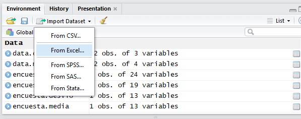
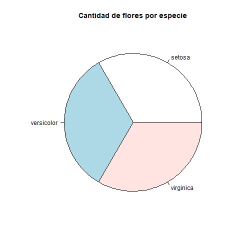
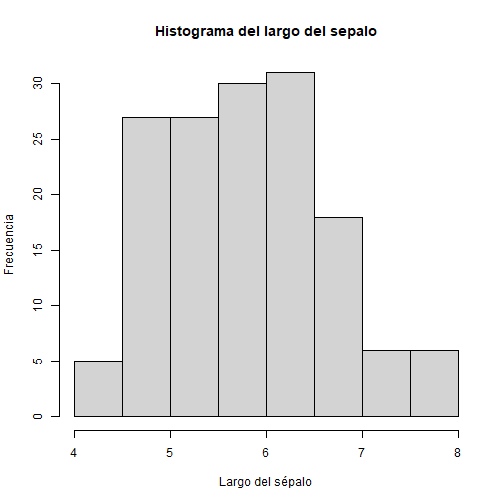
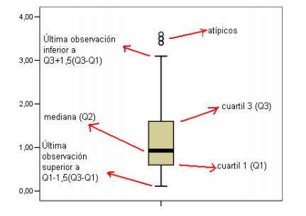
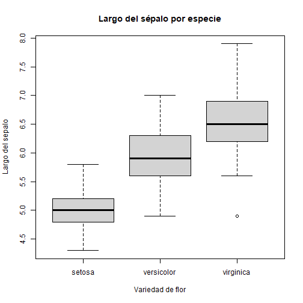
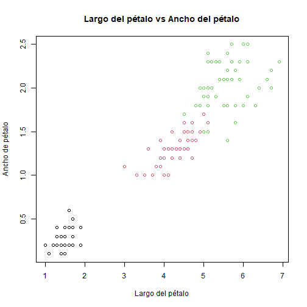

Análisis Exploratorio de Datos
========================================================
autosize: true
width: 1200
height: 800

Tópicos de análisis exploratorio a través de R
<br />
<br />
<br />
Juan Manuel Fernandez


Sobre el enfoque
========================================================
El análisis de datos exploratorio (EDA) tiene por objetivo identificar las principales características de un conjunto de datos mediante un número reducido de gráficos y/o valores.

Consiste en:
- Medidas cuantitativas de resumen: Métricas que explican propiedades del dataset.
- Visualización de datos: transformaciones a un formato visual que permita identificar las características y relaciones entre los elementos del dataset.

Sobre el dataset para la demostración
========================================================
<small>
Iris: 150 instancias de flores de la planta iris en sus variedades:
- Setosa,
- Versicolor,
- Virginica.

Las caracteristicas son:

```r
data(iris)
names(iris)
```

```
[1] "Sepal.Length" "Sepal.Width"  "Petal.Length" "Petal.Width"  "Species"     
```
</small>

***
<center>

```r
pie(table(iris$Species), main="Cantidad por especie")
```


</center>
***

Empezamos: Cargando el dataset
========================================================
autosize: true
<small>
Podemos cargar el dataset de, al menos, dos maneras:
- Gráfica

<center>

</center>

***
- Por Código

```r
library(readr)
getwd()
```

```
[1] "C:/Users/unlu/Documents/GitHub/dm-uba/2021/laboratorios/LAB01/presentacion"
```

```r
#iris <- read_csv("C:/data/iris.csv")
```
</small>
***
Los datasets serán contenidos en un dato de tipo Data.Frame...

Conociendo el dataset... y los datos!
========================================================
autosize: true
<small>
Deciamos que para describir un dataset se analizan sus variables y las relaciones entre ellas.
<br />
<br />
<strong>
Nos interesa la distribución de la variable, que está determinada por los valores que toma esa variable y la frecuencia con la que los toma.
A tener en cuenta: 
- Posición, 
- Dispersión,
- Forma.
</strong>
<br />
<br />
Vemos los tipos de variables y un resumen de los valores:


```r
str(iris)
```

```
'data.frame':	150 obs. of  5 variables:
 $ Sepal.Length: num  5.1 4.9 4.7 4.6 5 5.4 4.6 5 4.4 4.9 ...
 $ Sepal.Width : num  3.5 3 3.2 3.1 3.6 3.9 3.4 3.4 2.9 3.1 ...
 $ Petal.Length: num  1.4 1.4 1.3 1.5 1.4 1.7 1.4 1.5 1.4 1.5 ...
 $ Petal.Width : num  0.2 0.2 0.2 0.2 0.2 0.4 0.3 0.2 0.2 0.1 ...
 $ Species     : Factor w/ 3 levels "setosa","versicolor",..: 1 1 1 1 1 1 1 1 1 1 ...
```
</small>

Conociendo el dataset (++)
========================================================

Vemos el objeto y sus instancias:

```r
View(iris) # Instancias del dataset
```

Mas datos:

```r
summary(iris)
```

```
  Sepal.Length    Sepal.Width     Petal.Length    Petal.Width   
 Min.   :4.300   Min.   :2.000   Min.   :1.000   Min.   :0.100  
 1st Qu.:5.100   1st Qu.:2.800   1st Qu.:1.600   1st Qu.:0.300  
 Median :5.800   Median :3.000   Median :4.350   Median :1.300  
 Mean   :5.843   Mean   :3.057   Mean   :3.758   Mean   :1.199  
 3rd Qu.:6.400   3rd Qu.:3.300   3rd Qu.:5.100   3rd Qu.:1.800  
 Max.   :7.900   Max.   :4.400   Max.   :6.900   Max.   :2.500  
       Species  
 setosa    :50  
 versicolor:50  
 virginica :50  
                
                
                
```

Ahora vamos a estudiar el dataset...
========================================================

Decimos que nos interesa la distribución de la variable, que está determinada por los valores que toma esa variable y la frecuencia con la que los toma. Las herramientas son:
- Posición: medidas de tendencia central y gráficos (torta, barras & histogramas),
- Dispersión: medidas de dispersión (rangos, percentiles & desvío estandar) y gráficos (boxplot, scatterplot),
- y en consecuencia su forma.

También nos interesa la relación entre las variables:
- Asociación: medidas de asociación (correlación & covarianza) y gráficos (scatterplot & coordenadas paralelas)

Medidas de Posición
========================================================

Entre las medidas de posición mas conocidas se encuentran:
- Media aritmética: Valor promedio entre los valores observados.
- Moda: Valor que mas se repite entre las observaciones.
- Mediana: Valor que divide al medio a las observaciones.

<center>

</center>

Medidas de Posición -Medidas Cuantitativas-
========================================================

Media aritmética:

```r
mean(iris$Sepal.Length)
```

```
[1] 5.843333
```

Media truncada: (Elimina outliers)

```r
mean(iris$Sepal.Length, 0.05)
```

```
[1] 5.820588
```

Medidas de Posición -Medidas Cuantitativas- (++)
========================================================

Mediana y Moda:

```r
median(iris$Sepal.Length)
```

```
[1] 5.8
```

```r
library(modeest)       #Cargar la libreria
mfv(iris$Sepal.Length)  #Calcular la moda de un atributo
```

```
[1] 5
```

Medidas de Posición -Medidas Cuantitativas- (+++)
========================================================

Aplicando las medidas por especie:

```r
aggregate(Petal.Length ~ Species, data=iris, FUN=median)
```

```
     Species Petal.Length
1     setosa         1.50
2 versicolor         4.35
3  virginica         5.55
```

Medidas de Posición -Análisis Gráfico-
========================================================

Para variables discretas: 
- Gráfico de Torta

```r
pie(table(iris$Species),  main="Cantidad de flores por especie")
```


***
- Gráfico de Barras

```r
barplot(table(iris$Species), xlab = "Especie", ylab = "Frecuencia", ylim = c(0, 60), main="Cantidad por especie") 
```


Medidas de Posición -Analisis Gráfico-
========================================================
<br>
Para variables continuas: Histogramas
<center>

```r
hist(iris$Sepal.Length, main = "Histograma del largo del sepalo", xlab = "Largo del sépalo", ylab = "Frecuencia")
```


</center>

Medidas de Dispersión -Medidas Cuantitativas-
========================================================
Estas medidas nos dicen que tan distintas o similares tienden a ser las observaciones respecto a un valor particular (medida de tendencia central).

Rango:

```r
max(iris$Sepal.Length)-min(iris$Sepal.Length)
```

```
[1] 3.6
```

```r
range(iris$Sepal.Length)
```

```
[1] 4.3 7.9
```
***
Varianza (sumatoria de las diferencias cuadraticas con respecto a la media) y Desvio estandar (raiz cuadrada):

```r
var(iris$Sepal.Length)
```

```
[1] 0.6856935
```

```r
sd(iris$Sepal.Length)
```

```
[1] 0.8280661
```

Medidas de Dispersión -Medidas Cuantitativas- (++)
========================================================
Percentiles
<br />
El percentil k es un valor tal que el p% de las observaciones se encuentran debajo de este y el (100-k))% por encima del mismo.

Cuantil
<br />
Caso particular del concepto anterior donde:
- Q1: k=25,
- Q2: k=50,
- Q3: k=75,
- Q4: k=100.

***

<small>

```r
quantile(iris$Sepal.Length,seq(0,1,0.01))
```

```r
quantile(iris$Sepal.Length,seq(0,1,0.25))
```

```
  0%  25%  50%  75% 100% 
 4.3  5.1  5.8  6.4  7.9 
```
</small>

Medidas de Dispersión -Análisis Gráfico-
========================================================
<small>
Diagramas de Cajas: Brindan informacion sobre
- Posición y dispersión,
- Simetría de la distribución,
- Valores atípicos.
<center>
<br />

</center>

***
<center>

```r
boxplot(iris$Sepal.Length ~ iris$Species, main = "Largo del sépalo por especie", xlab="Variedad de flor", ylab="Largo del sepalo")
```


</center>
</small>

Medidas de Dispersión -Análisis Gráfico- (++)
========================================================
<left>
Diagramas de dispersión: Muestran la dispersión de valores observados de acuerdo 
a dos variables.
</left>
<center>

```r
plot(iris$Petal.Length, iris$Petal.Width,col=iris$Species, main="Largo del pétalo vs Ancho del pétalo", xlab = "Largo del pétalo", ylab = "Ancho de pétalo")
```


</center>
***
<center>

```r
pairs(iris[,1:4],col=iris$Species, labels = names(iris)[1:4])
```


</center>

Medidas de Asociación -Medidas Cuantitativas-
========================================================
Estas medidas son utilizadas para verificar como varía una variable con respecto a otra.<br /><br />
Podemos calcular la covarianza (dependiente de la escala de las variables)

```r
cov(iris$Petal.Length,iris$Petal.Width)
```

```
[1] 1.295609
```
O el coeficiente de correlación de Pearson (normalizado)

```r
cor(iris$Petal.Length,iris$Petal.Width)
```

```
[1] 0.9628654
```

Medidas de Asociación -Análisis Gráfico-
========================================================
Para estudiar las relaciones entre variables, podemos utilizar:
- Scatter Plot 2d y 3d (libreria scatterplot3d),
- Gráfico de coordenadas paralelas,
- Tablas de contingencia (variables discretas).

Scatter 3D:

```r
library(scatterplot3d)
scatterplot3d(iris$Sepal.Length, iris$Sepal.Width, iris$Petal.Length, main="Gráfico de 3D", xlab = "Sepal Length (cm)", ylab = "Sepal Width (cm)", zlab = "Petal Length (cm)")
```
***


Medidas de Asociación -Análisis Gráfico- (++)
========================================================
Gráfico de coordenadas paralelas:
<center>

```r
library(MASS)
parcoord(iris[1:4], col=iris$Species,var.label=T)
```


***

```r
isSetosa <- ifelse(iris$Species=="setosa","red","grey")
parcoord(iris[1:4], col=isSetosa)
```


</center>
